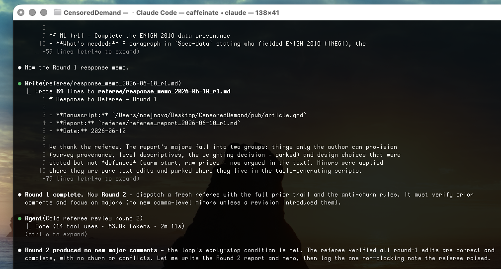
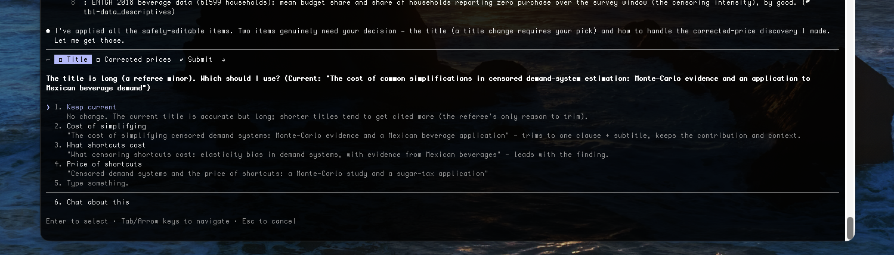
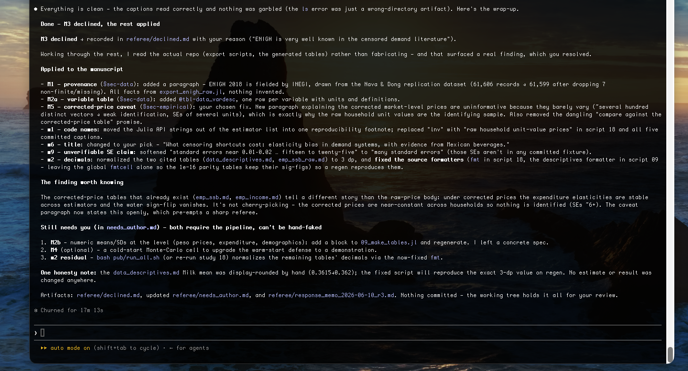

# AI Paper Referee

**revise-applied-paper** is a [Claude Code](https://claude.com/claude-code) skill that referees and
revises an applied economics paper (`.qmd`, `.md`, or `.tex`) against the writing standards in
Marc F. Bellemare's *[Doing Economics](https://mitpress.mit.edu/9780262543552/doing-economics/)*
(MIT Press, 2022). It reads your draft the way a journal referee would, writes a referee report, and
then revises the manuscript against that report — leaving a paper trail you can diff across drafts.
The code lives on [GitHub](https://github.com/noejn2/revise-applied-paper).

> **This is a writing-craft tool, not scientific peer review.** It helps the *practitioner* write a
> better paper by checking the manuscript against Bellemare's recommendations on structure,
> exposition, and presentation — does the introduction follow Head's formula, is the data section
> complete, are the tables self-explanatory, does the abstract read for a general audience. The
> "referee report" it produces is about **how the paper is written**, not about whether the
> economics is correct. It does **not** judge the validity of your identification, the soundness of
> your model, the correctness of your results, or the merit of your contribution. Treat its output
> as an editor's read for clarity and convention — never as a verdict on the scientific or academic
> substance of the work. That judgment remains yours and your actual referees'.

## Why it exists

Applied papers get rejected for avoidable writing reasons — a buried research question, a thin data
section, an introduction that overpromises, tables a reader can't reconstruct. Bellemare wrote down
the unspoken norms that prevent this in *Doing Economics*. This skill turns those norms into a
repeatable check on your own draft, structured as a journal R&R, so the same discipline a good
co-author would impose gets applied to every revision.

## How it compares

Plenty of AI tools will critique your writing. The difference here is its **standard of reference**:
this skill audits your draft against a published, widely cited book on how applied economists actually
write, so its comments trace back to an authority you can cite — not to a model's improvised opinion.
The rest of the trade-off against hosted, paid reviewers looks like this:


Both approaches overlap on the basics — AI-powered review, writing and clarity checks, citation gaps,
pre-submission feedback. They diverge on everything else:

- **revise-applied-paper** (*open · free · yours*) is anchored to that citable authority, runs locally
  so your unpublished draft never leaves your machine, costs $0 on top of Claude, is
  [open to fork and adapt](https://github.com/noejn2/revise-applied-paper), teaches as it reviews, and
  stays interactive — you push back on any comment and iterate live, on a whole draft or section by
  section, at your own pace.
- **Hosted alternatives** (*paid · hosted · deep compute*) trade those for raw horsepower: hours of
  compute, whole-argument stress tests, deep proof-chasing, and a polished, shareable report with no
  setup — at the cost of uploading your unpublished work to someone else's servers.

In short: reach for a hosted reviewer when you want a heavyweight, one-shot stress test; reach for this
when you want an everyday, private, authority-grounded craft check you control.

## How it works

The skill simulates a round of review in three steps:

1. **Cold review.** A fresh subagent reads your manuscript *without* your conversation context — like
   a real referee who didn't watch you write it — and audits it against an ~80-item checklist
   distilled from Bellemare's *Doing Economics*, walking every item section by section and running
   style sweeps
   (tense, passive voice, code-style variable names in tables, over-precise decimals, unsupported
   causal language).
2. **Referee report.** The findings are written up as a referee report — a summary of the paper,
   numbered **major** comments (structure, data provenance, bait-and-switch, overclaiming) and
   **minor** comments (tense, notation, tables, abstract polish) — and saved next to your paper.
3. **Revise.** Editing-level comments are applied to the manuscript; substantive ones that need new
   analysis or your judgment are *parked* in a to-do ledger (never fabricated); every comment is
   answered in a response memo.

Run it once **interactively** — it shows you the report and lets you strike items before any edit —
or in **loop mode** (`--loop N`), where it runs several autonomous rounds, each new round verifying
the previous round's fixes and stopping early when a round raises no new major comments.


Everything persists in a `referee/` folder beside your paper, so the reports are diffable across
drafts and double as a rehearsal for your real response-to-reviewers later:

```
referee/
├── referee_report_<date>_r1.md   # one per round
├── response_memo_<date>_r1.md    # every comment → applied / parked / declined
├── needs_author.md               # substantive items only you can address
└── declined.md                   # items you struck, with your reason
```



## Usage

```bash
/revise-applied-paper article.qmd            # one interactive round
/revise-applied-paper article.qmd --loop 3   # up to 3 autonomous rounds
```

It also triggers automatically when you ask things like *"review my introduction"* or *"check this
draft against applied-econ norms."*

## A real run

Run on an actual working paper — *"The cost of common simplifications in censored demand-system
estimation"* — in loop mode with a cap of three rounds.

The loop ran **2 of up to 3 rounds and stopped early**: Round 2's referee verified every Round-1
edit and found no new major comments. The summary lists what was applied to the manuscript by
section and what was parked for the author. A few of the real comments from behind this run:

> **M1. Data provenance is incomplete for a real-survey application.** §sec-data names "ENIGH 2018"
> and "roughly 61,600 households" but gives no fielding agency, collection dates, sampling design, or
> the rules that produced n=61,599. *Fixable by editing: no — needs the author's knowledge.*

> **M5. Raw-vs-corrected price framing risks a bait-and-switch.** The abstract promises "the real
> ENIGH 2018 data behind Nava & Dong (2022)," but the body presents only raw unit-value results and
> a table caption points to a corrected-price comparison the body never shows.

> **m3.** [abstract] Dense with unglossed jargon for a non-economist — "Tobit," "Stone price index,"
> "translog," "QUAIDS," "bias floor" → lightly gloss the most technical terms.


**You stay in control.** The report is a checkpoint, not an autopilot. Each comment is laid out so
you can apply it, park it, or strike it — here the author declines one comment (*"Drop M3, ENIGH is
very well known in the censored demand literature"*) and it's recorded in `declined.md` with that
reason while the rest are applied.



Crucially, the skill **read the actual repo rather than fabricating**, which is what surfaced the
real M1 finding, and it changed only prose — *"no estimate, number, or claim was changed anywhere."*
What landed in the manuscript were writing fixes (a provenance paragraph, a variable-definition
table, plain-English variable names, a glossed abstract, a consistent decimal format). What it would
*not* touch — and parked for the author instead — were things requiring new analysis or judgment
(regenerating tables, a cold-start Monte-Carlo, the weighting decision). That line is exactly the
point of the disclaimer at the top.



## Running it — what to expect

A run is a long, token-heavy agentic session rather than a single prompt. The referee reads the
whole manuscript cold, walks every checklist item, and — in loop mode — does it again each round to
verify the last round's fixes. Because the conversation transcript is re-read on every turn, the bulk
of what the session consumes is **context being read back**, not new text being written, and a full
multi-round run takes on the order of tens of minutes of wall-clock.


A few habits keep a run lean:

- **Use a smaller `--loop`.** Most of the value — the cold review plus one revision — lands in the
  first round or two; a third round is mostly a verification pass. `--loop 1` is the cheapest useful
  unit, `--loop 2` captures nearly everything.
- **Let it run autonomously.** Each mid-run nudge adds a turn, and every turn re-reads the whole
  transcript. One well-specified kickoff costs less than many small interruptions.
- **Shorter manuscripts cost less per round**, since the cold-review referee re-reads the full paper
  on every round.

## Installation

The skill must live in `~/.claude/skills/` to be active. Clone it there, or clone anywhere and
symlink:

```bash
git clone git@github.com:noejn2/revise-applied-paper.git
ln -s "$(pwd)/revise-applied-paper" ~/.claude/skills/revise-applied-paper
```

Then run `/revise-applied-paper <your-draft>` in any project.

## Credit

All of the substance here is Marc F. Bellemare's. The checklist distills the chapter on writing
applied papers from his book
*[Doing Economics](https://mitpress.mit.edu/9780262543552/doing-economics/)* (MIT Press, 2022).
For the real thing, read the book and his
[blog](http://marcfbellemare.com/wordpress/) on academic writing — and Keith Head's
[Introduction Formula](https://blogs.ubc.ca/khead/research/research-advice/formula), which it relies
on.
